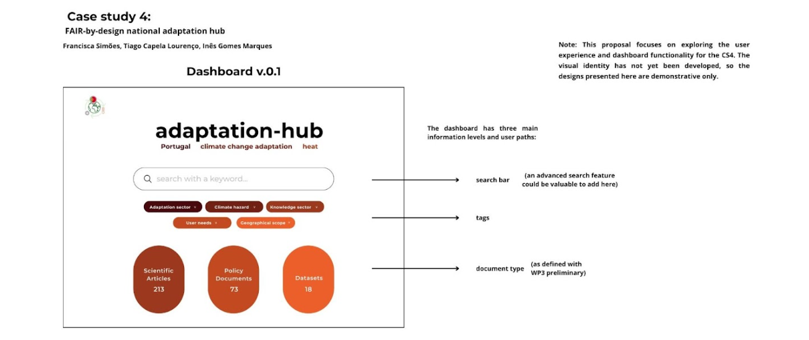

 
This section outlines the requirements for the dashboard. It includes a high-level overview of the main features and visual mockups to provide a clear understanding of the final product.
 

### Services/Dashbord Requirements:
- **Description**: _Briefly outlines the requirements for the dashboard and how this view addresses the stakeholder’s need._
- **Dashboard View**:   _Dashbord Images for expected pages_
- **Table description for Target users**:   _Briefly outlines target users(e.g. Researchers, Policymakers)_
- **Table description for Service functinality and resources**:   _Briefly outlines target users(e.g. Researchers, Policymakers)_

---
## 1. Featuers Description of Services

---
## 2. Resources feeding Dashboard/Services 
this dashbard will be feed by comprehensive survey on portughal 
- Retrival/Search APIs using ROHub API documentation link: [link](https://reliance-eosc.github.io/rohub-portal-documentation/).
- Private/Public List of resources/content in csv or Excel [link](https://example.com)

---
## 3. Interacting with avalible F2A APIs 
- Retrival APIs using [ROHub](https://www.rohub.org/)
- Using connectivity-hub for Climate Connectivity Taxonomy [Taxonomy API Documentation]("https://connectivity-hub.com//)
---
## 4.Dashboard Pages Mockups
The dashboard mockup requires a visual representation of a dashboard's layout, structure, and key elements. It includes components like the navigation menu, data tables, plots, and filters. Mockups are used in the design process to plan the user interface (UI) and user experience (UX) before development process.

---

## 5. Target Users

This section identifies the intended users for the service knowledge and dashboard, clarifying who will be using it and for what purpose.

| Role Based Access Control     | Stakeholders Sample                          | Asset Access Level                  | Resource                                                                 |
|-------------------------------|----------------------------------------------|-------------------------------------|--------------------------------------------------------------------------|
| **Public / Unauthenticated User** |  Researchers Organizations |  - Public                           |                      links of the CSV files and papers                                                   |

---

## 6. List of API Services(technical description)

This section need to provides required table description of the different types of API services in the dashbord.

---

## 6. API Specification Link 
link

